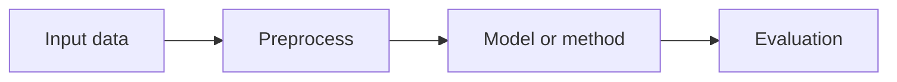

# Draw.io Workflow

Use this reference when the user needs an editable diagram rather than a
conversation-only sketch.

## Start With Structure

Write a small Mermaid draft first unless the user already gave a layout:



Use the draft to settle nodes, arrows, and grouping. Do not spend time on draw.io
geometry until the structure is stable.

## When To Create `.drawio`

Create a `.drawio` file when the user needs:

- editable source for a paper, report, or GitHub docs page
- manual alignment, nested groups, or callouts
- SVG/PNG/PDF exports from the same source
- a diagram that will be revised over several rounds

## Minimal XML Shape

A draw.io file is XML. The inner model is usually an `mxGraphModel` with
`mxCell` nodes and edges. Keep generated XML simple:

- one page unless the user asks for multiple pages
- deterministic ids such as `node-input`, `edge-input-preprocess`
- readable labels without private names or local paths
- grouped sections only when they reduce clutter

Skeleton:

```xml
<mxfile host="app.diagrams.net">
  <diagram name="Page-1">
    <mxGraphModel grid="1" gridSize="10" page="1">
      <root>
        <mxCell id="0"/>
        <mxCell id="1" parent="0"/>
      </root>
    </mxGraphModel>
  </diagram>
</mxfile>
```

## Export Notes

If the user has draw.io Desktop CLI installed, export can be scripted:

```bash
drawio --export --format svg --output docs/diagram.svg docs/diagram.drawio
drawio --export --format png --output docs/diagram.png docs/diagram.drawio
```

If the CLI is not installed, tell the user to open the `.drawio` file in
diagrams.net and export SVG or PNG manually. Do not claim an export exists until
the file has been generated and checked.
